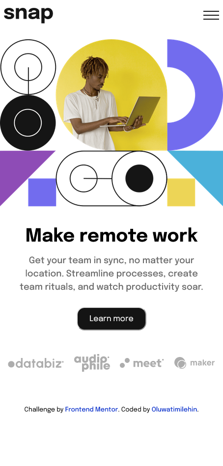

# Frontend Mentor - Intro section with dropdown navigation solution

This is a solution to the [Intro section with dropdown navigation challenge on Frontend Mentor](https://www.frontendmentor.io/challenges/intro-section-with-dropdown-navigation-ryaPetHE5). Frontend Mentor challenges help you improve your coding skills by building realistic projects.

## Table of contents

- [Overview](#overview)
  - [The challenge](#the-challenge)
  - [Screenshot](#screenshot)
  - [Links](#links)
- [My process](#my-process)
  - [Built with](#built-with)
  - [What I learned](#what-i-learned)
  - [Useful resources](#useful-resources)
- [Author](#author)

## Overview

### The challenge

Users should be able to:

- View the relevant dropdown menus on desktop and mobile when interacting with the navigation links
- View the optimal layout for the content depending on their device's screen size
- See hover states for all interactive elements on the page

### Screenshot



### Links

- Solution URL: [Frontend Mentor](https://your-solution-url.com)
- Live Site URL: [Netlify](https://intro-with-dropdown-landing-page.netlify.app/)

## My process

I started development by setting up the page structure and components for each unique sections. Started developing the navigation for the mobile layout in it's respective component then moved on to the hero and complete structure. Then using CSS I styled the page then moved on to the sidebar. Created a custom hook (custom React context) to make the sidebar toggle available all through out the app. Then I proceeded to creating the dropdown sections for the sidebar.

### Built with

- Semantic HTML5 markup
- Flexbox
- CSS Grid
- Mobile-first workflow
- [React](https://reactjs.org/) - JS library

### What I learned

```js
const sidebar_reducer = (state, action) => {
  if (action.type === 'OPEN_SIDEBAR') {
    return { ...state, isSidebarOpen: true };
  }
  if (action.type === 'CLOSE_SIDEBAR') {
    return { ...state, isSidebarOpen: false };
  }
  throw new Error(`No Matching "${action.type}" - action type`);
};
```

- Custom Hook for Sidebar toggle

```js
const initialState = {
  isSidebarOpen: false,
};

const SidebarContext = React.createContext();
export const SidebarProvider = ({ children }) => {
  const [state, dispatch] = useReducer(reducer, initialState);

  const openSidebar = () => {
    dispatch({ type: 'OPEN_SIDEBAR' });
  };

  const closeSidebar = () => {
    dispatch({ type: 'CLOSE_SIDEBAR' });
  };

  return (
    <SidebarContext.Provider
      value={{
        ...state,
        openSidebar,
        closeSidebar,
      }}
    >
      {children}
    </SidebarContext.Provider>
  );
};

export const useSidebarContext = () => useContext(SidebarContext);
```

### Useful resources

## Author

- Website - [Github](https://github.com/tea-scripts)
- Frontend Mentor - [@yourusername](https://www.frontendmentor.io/profile/yourusername)
- Twitter - [@tea\_\_scripts](https://twitter.com/tea__scripts)
